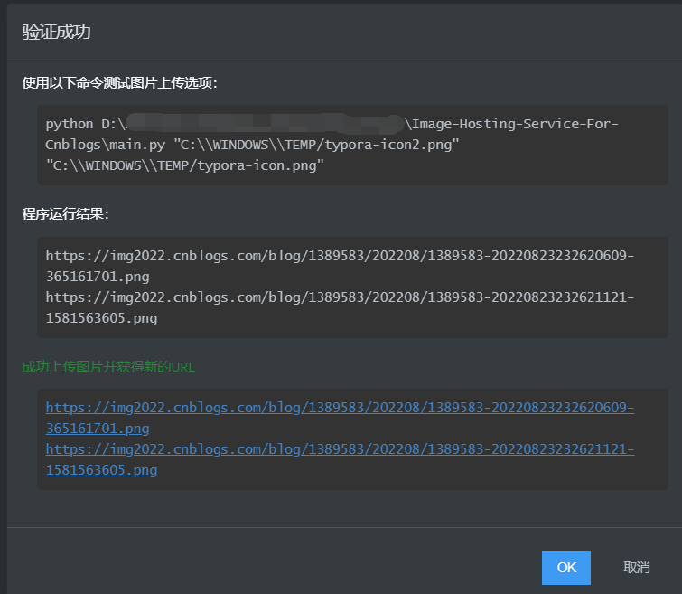
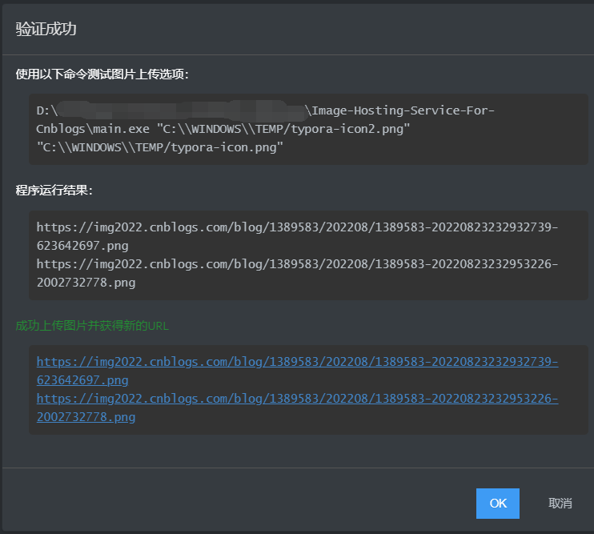

## Image-Hosting-Service-For-Cnblogs（博客园图床）

### 1. Introduce

通过博客园提供的MetaWebBlog API，实现图床功能。

如果想知道更详细的细节，可以查看 **./dev_notes/** 目录。 

### 2.Configuration

只需要配置 config.json 文件，以下是每一项，在博客园的个人设置中都有

- MetaWeblogUrl
- blogid： 暂时没有用处，不需要填
- username
- password：已经不支持使用密码登录了，现在需要使用令牌作为密码

### 3. Use

​	以 **typora** 使用为例：

- 方法1：

  直接下载 main.py 文件，并且配置好 config.json 文件。

  在 **typora**中，选择 **文件 --> 偏好设置 --> 图像 --> 自定义命令 --> 输入 python {main.py的绝对路径}**

  `python D:\dev\Image-Hosting-Service-For-Cnblogs\main.py`

  

- 方法2：

  直接下载我编译好的 main.exe 文件，并且配置好 config.json 文件。

  在 **typora**中，选择 **文件 --> 偏好设置 --> 图像 --> 自定义命令 --> 输入 main.exe的绝对路径**

  `D:\dev\Image-Hosting-Service-For-Cnblogs\main.exe`

不管哪一种方法，都需要确保 （main.py 或者 main.exe） 与 config.json 在同一目录下。

如果你的计算机没有python环境，请使用 方法2。

### 4. Reference

[xiajingren/EasyBlogImageForTypora](https://github.com/xiajingren/EasyBlogImageForTypora)